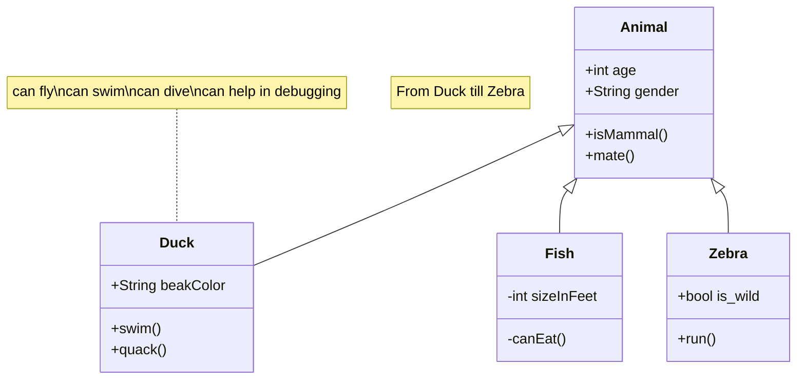
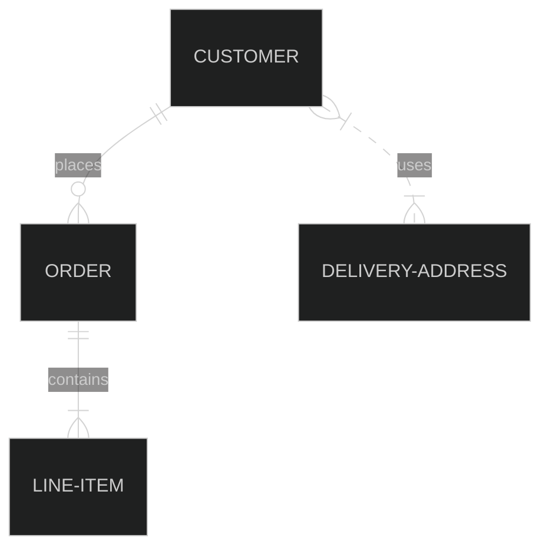

# Todo
 * [ ] nest file is not unnesting
 * [ ] some support of events 
    - in extension, some event handlers will be added
    - extension must not be destroyed
    - but can be destroyed when runs again or in new version
    - optionaly exec something like Destroy() method
    - add autoRun to extension options?
    - that extensions should be destroyed on solution unload

### Nest file extension
* Cannot find how to un-nest item, there are missing methods for that
```c#
    var project = dte.Solution.Projects[0] as EnvDTE.Project;
    var item = project.ProjectItems[0] as EnvDTE.ProjectItem;
    var srcFile = item.Name;
    // not interesting : .Object as VSLangProj.VSProjectItem)
    var nestedItem = item.ProjectItems[0] as EnvDTE.ProjectItem;
    var file2 = nestedItem.Name;
    //how to remove it?
    //no Remove() on ProjectItems
```
 

 ###  package argument 
* is out-of-process 
* is it somehow possible to find package argument obj in Launcher from DTE ?
* probably not posible, without registering assembly to allow marshalling (usage from another process)
* for same reson IServiceProvider cannot be used (marshalling)
* try `[assembly: ComVisible(true)]` and GUID, than own serviceprovider?

## events support
* DTE events are very general
* launcher: process shouldn't stop
    * test: can events go thru processes
    * maybe wait for some signal/method from extension?
    * or just show dialog "Press OK to stop"
* if solution changes, and extensions are re-loaded
    * old extension instance "Destroy" must be called to remove events


# refactoring
* _DesignData - WPF, DTE, 
  * [ ] TODO: rename
* Commands - DTE, VSIX
* Converters - WPF
* Extensions - internal ext. DTE, VSIX
    * Dumper uses ReflectionXmlDumper, DTE, rozumi DTE objektum
    * DumpExtension, DumpExtensionMore,NestFile
* Images - doc only
* Launcher - DTE,Launcher
    * ExtensionDebugger - runs exe using DTE, LauncherProcess
        * [ ] TODO: merge?
    * ExtensionObject - used also from Launcher
        * needs DTE as parameter
    * LauncherProcess - just wrapper for running process
    * RunningComObjects - just COM extern wrapper to use ROT
        * [ ] TODO: move to another place, ns?
* Model - plain .net
    * ExtensionModel - using SimpleDataObject
    * ExtensionSerialization - using ExtensionModel 
    * SimpleDataObject
    * [ ] todo: move to namespace?
* Reflection - plain .net
    * ReflectionBuilderCS, ReflectionXmlDumper
        * [ ] TODO: rename and refact
    * ReflectionCOM
    * ReflectionHelper
* ReflectorControl - WPF
    * xaml - needs colors from PlatformUI and VSStyles.xaml
    * (TreeView) style with Stretch HorizontalAlignment
    * cs - using ReflectorFactory
    * ReflectorFactory
    * ReflectorModel 
    * ReflectorNodeBuilder 
    * ReflectorTextBuilder
    * ReflectorXmlBuilder
 * Themes - VsStyles.xaml
 * ToolWindows
    * ExtensionsListToolWindow - WPF, ui, VSStyles.xaml, DTE, Package, Pane
        * [ ] todo: refactor DI
        * [ ] todo: (not needed) refact VSStyles.xaml
    * ExtensionsListToolWindowPane
    * MoveAdorner - just WPF, 
        * [ ] TODO: refact D&D from ExtensionsListToolWindow  
    * ReflectorToolWindow - shell, ui, VSstyles.xaml, DTE, ReflectorToolWindowPane
        * [ ] todo: refactor DI
        * [ ] todo: (not needed) refact VSStyles.xaml
 * DteExtensions
 * DataExtensions - plain .net
 * OleExtensions - DTE
 * ExtensionManager - uses DTE,package
 * SolutionExtensionsPackage
 * StringTemplates - plain .net
 * WpfExtensions - uses DTE, etc?
    * [ ] TODO: refact

# mermaid tests


## ER mermaid

